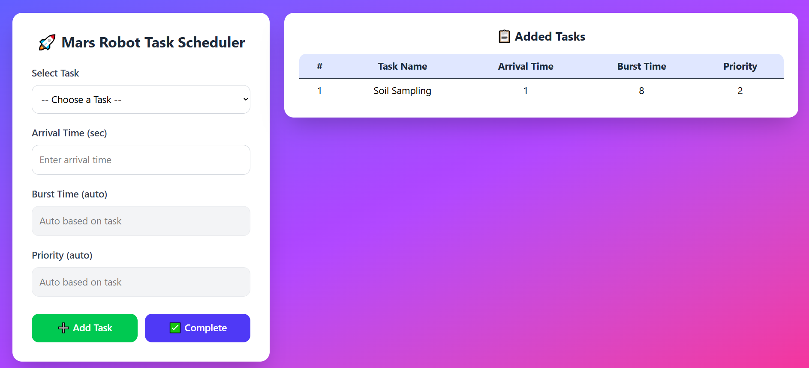

# 🚀 Mars Robot Task Scheduler Form

A modern, responsive React.js form that allows users to schedule and manage tasks for a Mars exploration robot. The form automatically assigns burst time and priority based on the selected task and displays all added tasks in a structured table.

---

## 📸 Screenshot





---

## ✨ Features

* ✅ Select predefined robot tasks
* ✅ Automatic **burst time** assignment
* ✅ Automatic **priority** assignment
* ✅ Add multiple tasks with arrival time
* ✅ Auto-renaming of duplicate tasks (Task 2, Task 3, etc.)
* ✅ Live task preview in a table
* ✅ Responsive modern UI
* ✅ Clean and user-friendly design
* ✅ Built using React Hooks
* ✅ Styled with Tailwind CSS

---

## 🧠 How It Works

1. Select a task from the dropdown.
2. Enter the arrival time.
3. Burst time and priority are filled automatically.
4. Click **Add Task** to insert it into the table.
5. Repeat to add more tasks.
6. Click **Complete** to finalize the task list.

Each task includes:

* Task Name
* Arrival Time
* Burst Time
* Priority

---

## 🛠️ Built With

* **React.js**
* **JavaScript (ES6)**
* **Tailwind CSS**
* **Vite / Create React App**

---

## 📂 Project Structure

```
src/
├── App.jsx         # Main app component
├── TaskForm.jsx    # Task scheduling form component
├── main.jsx        # App entry point
├── index.css       # Global styles
```

---

## 🚀 Getting Started

Follow these steps to run the project locally:

### 1️⃣ Clone the Repository


### 2️⃣ Go to Project Folder


### 3️⃣ Install Dependencies


### 4️⃣ Start Development Server

---

## 📋 Task List Logic

* Each task has a predefined **burst time** and **priority**
* Tasks are auto-numbered when duplicates exist
* Data is stored in component state using `useState`
* The task list updates in real-time

---

## 📌 Available Tasks

* Environment Scan
* Soil Sampling
* Data Transmission
* Photo Capture
* Battery Recharge
* Defense System
* Self Cleaning

---

## ✅ Example Task Output

| Task Name         | Arrival Time | Burst Time | Priority |
| ----------------- | ------------ | ---------- | -------- |
| Photo Capture     | 2            | 12         | 1        |
| Data Transmission | 5            | 10         | 2        |

---

